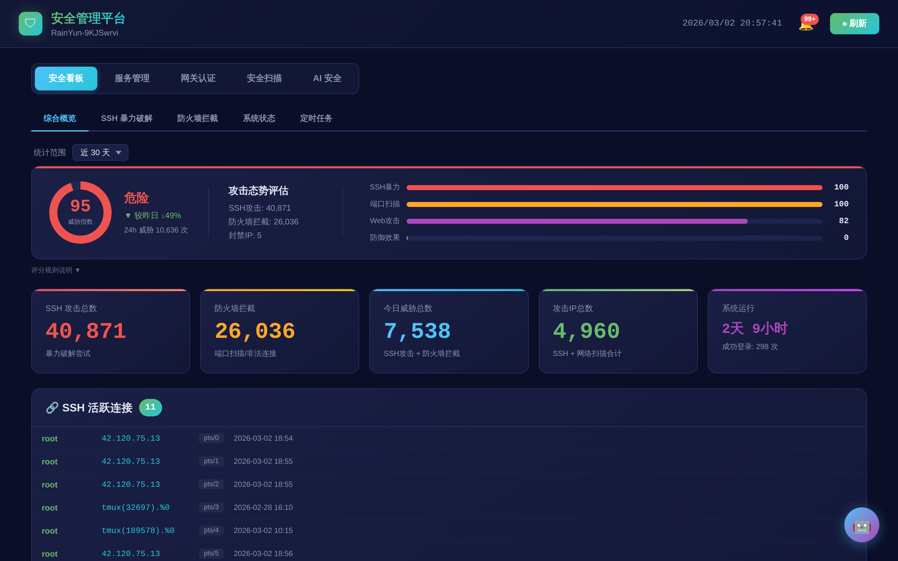
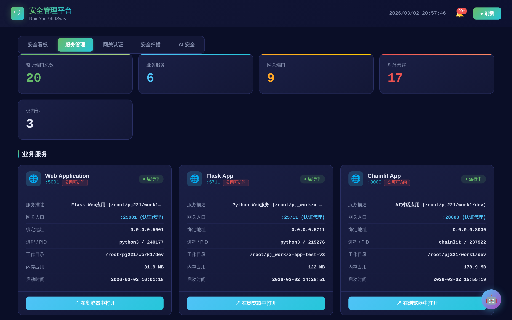
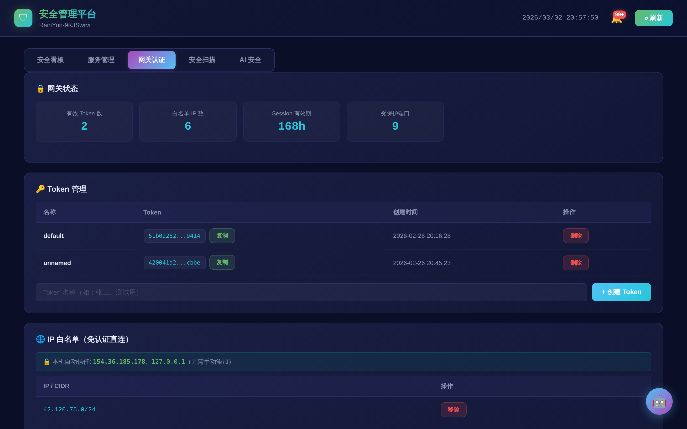
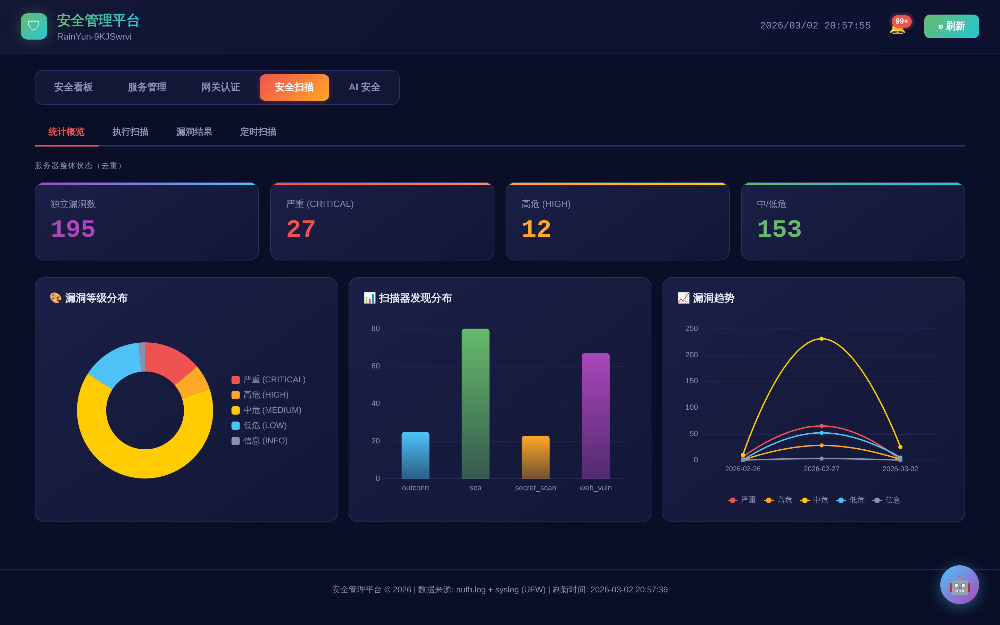
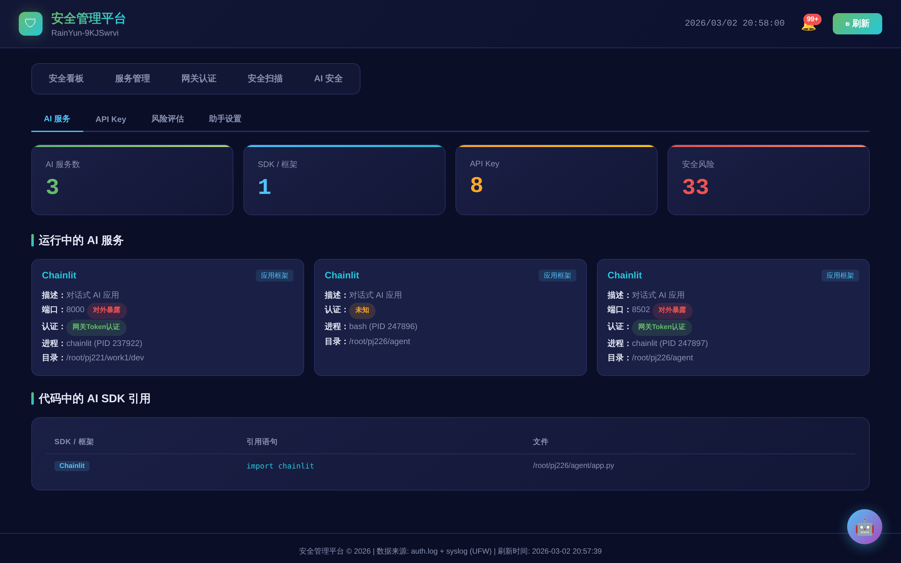

# SecGate - Linux Server Security Gateway

[中文](README.md) | **English**

> **One command to deploy, zero config to protect.** The only open-source tool that provides gateway authentication + attack monitoring + vulnerability scanning + AI assistant in ~120MB memory.

```bash
curl -fsSL https://github.com/zzmlb/secgate/releases/latest/download/install.sh | sudo bash
```

## Why SecGate

**Bridges the gap between Fail2Ban (too simple) and Wazuh (too heavy).**

| | Fail2Ban | CrowdSec | **SecGate** | 1Panel / BT Panel | Wazuh |
|---|---------|----------|-------------|-------------------|-------|
| Memory | <50 MB | ~100 MB | **~120 MB** | 500 MB - 2 GB | 4 GB+ |
| Auth Gateway | - | - | **Any TCP port** | - | - |
| Web Dashboard | - | Cloud console | **Local, full-featured** | Yes | Yes |
| Vuln Scanning | - | - | **5 built-in scanners** | - / Paid | Yes |
| Threat Score | - | Yes | **4-dimension scoring** | - | Yes |
| AI Assistant | - | - | **Built-in** | - | - |
| Multi-node Management | - | - | **SSH centralized** | - | Yes |
| Alert Engine | - | Yes | **8 auto rules** | - | Yes |
| Deployment | apt install | + Bouncer setup | **1 command, fully auto** | Install script | Multi-component tuning |
| Runs on 1C/1G | Yes | Barely | **Yes** | No | No |
| License / Cost | MIT / Free | MIT / Core free | **MIT / Fully free** | GPLv3 / Pro paid | Apache / Free |

### Core Strengths

| Strength | Details |
|----------|---------|
| **Auth Gateway (unique)** | iptables redirect + Nginx auth_request adds authentication to **any TCP port** with zero code changes. Surveyed 18 competitors (7 panels + 7 security tools + 4 cloud solutions) — **none offer this** |
| **Ultra lightweight** | 170 KB installer, ~120 MB runtime memory, runs smoothly on 1-core 1 GB VPS |
| **Fully automated setup** | 1 command configures Nginx / UFW / Fail2Ban / iptables / systemd — 10 steps, zero manual editing |
| **Threat posture scoring** | SSH brute force + port scanning + web attacks + defense effectiveness — 4-dimension log-weighted 0-100 score for instant security assessment |
| **AI security module** | 15+ AI provider key detection, 14 AI service auto-discovery, conversational security assistant — unique among open-source tools |
| **Multi-node management** | Manage multiple servers via SSH, auto-detect SecGate installation and running ports, single dashboard for all nodes |
| **Works with bare IP** | No domain required. Cloudflare / Pangolin require domains; SecGate protects bare IP servers directly |
| **Minimal attack surface** | 5,000 lines Python + 4,000 lines frontend — far smaller than admin panels (BT Panel / CyberPanel have had critical RCE and ransomware exploits) |

### Best For

- **Personal VPS** — Don't know security configs? Install and get instant protection
- **Multi-service servers** — Database, API, admin panel — unified gateway auth protects all ports
- **AI app deployment** — Gradio / Streamlit / Chainlit have no built-in auth; one-click protection
- **Quick hardening** — Competitions, demos, POC environments; deploy in minutes

### Recommended Stacks

| Stack | Description |
|-------|-------------|
| **SecGate alone** | Full server-level coverage, lightest footprint |
| **SecGate + Cloudflare Free** | SecGate for server layer, Cloudflare for HTTP layer (WAF / DDoS) — complementary, both free |
| **SecGate + CrowdSec** | Local protection + community threat intelligence, ~220 MB total |
| **SecGate + 1Panel** | Security (SecGate) + ops management (1Panel) — separation of concerns |

---

## Screenshots

| Security Dashboard — Attack Overview | Service Management — Port Gateway |
|:---:|:---:|
|  |  |

| Gateway Auth — Token & IP Whitelist | Security Scan — Vulnerability Detection |
|:---:|:---:|
|  |  |

| AI Security — Service Discovery & API Key Detection | Node Management — Multi-node Control |
|:---:|:---:|
|  |  |

## Requirements

- Ubuntu 20.04+ / Debian 11+
- Python 3.9+
- Root access

## Installation

Three options, all one-step:

### Option 1: Git Clone (Recommended)

```bash
git clone https://github.com/zzmlb/secgate.git /opt/secgate
cd /opt/secgate && sudo ./secgate setup
```

### Option 2: One-line Install

```bash
curl -fsSL https://github.com/zzmlb/secgate/releases/latest/download/install.sh | sudo bash
```

### Option 3: pip Install

```bash
pip install secgate
sudo secgate setup
```

> If `secgate` command is not found, use: `sudo python3 -m secgate_pkg setup`

### What `setup` Does Automatically

`secgate setup` completes all configuration in one command, no manual intervention:

1. Detects server public IP
2. Installs system dependencies (Nginx, iptables, UFW, Fail2Ban, curl)
3. Installs Python dependencies (Flask, psutil, requests, etc.)
4. Generates security credentials (Dashboard password, gateway signing key, Chainlit JWT secret)
5. Generates and enables Nginx auth gateway configuration
6. Configures iptables port redirection rules
7. Configures UFW firewall and allows required ports
8. Installs Gunicorn production WSGI server
9. Generates systemd services (auto-start on boot)
10. Starts all services

After deployment, the terminal outputs the dashboard URL and login credentials.

## CLI Commands

```bash
secgate start      # Start all services
secgate stop       # Stop all services
secgate restart    # Restart all services
secgate status     # Check running status
secgate creds      # Show login credentials
secgate version    # Show version
secgate update     # Update to latest (auto git pull + reinstall deps + restart)
```

## Features

### Tab 1: Security Dashboard

Security posture overview with 5 sub-tabs:

**Overview**
- **Threat Posture Score** — Full-width panel aggregating SSH brute force, port scanning, web attacks, and defense effectiveness into a 0-100 threat index with 5 severity levels (Safe / Notice / Warning / Severe / Critical)
- **5 Key Metric Cards** — SSH attacks, firewall blocks, today's threats, attack IPs, uptime
- **Active SSH Sessions** — Currently connected SSH sessions
- **Attack Origin Map** — Geographic distribution pie charts (ECharts)
- **Time Range Filter** — Switch between 1d / 3d / 7d / 15d / 30d

**SSH Brute Force**
- Attack trend charts (day / hour / minute granularity)
- 24-hour attack distribution heatmap
- Top 10 attacking IPs with geolocation
- Top 10 targeted usernames with percentages

**Firewall Blocks**
- Firewall block trend charts (day / hour / minute)
- Top 15 scanned ports
- Top 10 scanning source IPs
- Combined SSH vs firewall trend comparison

**System Status**
- SSH config, firewall, and Fail2Ban status with security recommendations
- CPU / memory / disk real-time monitoring
- Listening ports with process info and exposure status

**Cron Jobs**
- Task statistics and full cron job listing with filters

### Tab 2: Service Management

Full-picture view of all running services:
- Statistics overview (listening ports, services, gateway ports, exposed, internal-only)
- Business services with port, process, PID, exposure status, gateway protection status
- Gateway authentication layer details
- Infrastructure components

### Tab 3: Gateway Authentication

All gateway configuration via web UI — no file editing:
- **Gateway Status** — Active tokens, whitelisted IPs, protected ports
- **Token Management** — Create / view / delete 64-char security tokens
- **IP Whitelist** — Add/remove IPs or CIDR ranges (whitelisted IPs bypass auth)
- **Port Protection** — View protected ports, detect unprotected exposed ports, one-click protect all

### Tab 4: Security Scanning

5 built-in scanners, all operated from the web UI:

| Scanner | Function | Coverage |
|---------|----------|----------|
| SCA Dependency Scan | Detect known vulnerabilities in dependencies | Python / Node.js / Go / Java via OSV database |
| Secret Detection | Scan for leaked credentials in code and configs | 25+ regex rules: AWS Keys, GitHub Tokens, RSA keys, DB connection strings |
| Input Validation | Fuzz-test API endpoints | SQL injection, XSS, path traversal, SSRF |
| Exposure Detection | Detect unauthorized network service exposure | Port enumeration, MongoDB / Redis / MySQL / PostgreSQL / ES / Memcached unauth access |
| Web Security | Detect web service misconfigurations | SSL/TLS, security headers, cookies, sensitive paths, HTTP methods, CORS |

Also includes: real-time scan progress, scheduled scanning, severity-graded results with fix suggestions, false-positive allowlisting.

### Tab 5: AI Security

AI service security management and conversational assistant:
- **AI Services** — Auto-discover running AI services (Chainlit, Gradio, Streamlit, etc.)
- **API Keys** — Scan and display AI API keys from env vars and config files (redacted)
- **Risk Assessment** — High / medium / low risk breakdown with detailed findings
- **AI Assistant** — Natural language security Q&A powered by Claude Code CLI (read-only, dual auth)

### Tab 6: Node Management

Centrally manage multiple SecGate nodes via SSH:
- **Node Overview** — Total / online / offline / SecGate-installed counts. SecGate node cards with version, service status, clickable links. Full node table with test, detect, edit, delete actions
- **Add Node** — Three auth methods: key file (auto-detect from ~/.ssh/), password, paste private key content. Test connection before saving. Edit existing nodes with masked credentials
- **SecGate Detection** — 5-step read-only strategy: VERSION file → secgate status → PID-to-port lookup → systemd fallback → curl port probe. Auto-discovers actual Dashboard and Gateway ports without hardcoding

### Alert Engine (8 Auto Rules)

| Rule | Level | Interval | Description |
|------|-------|----------|-------------|
| SSH password auth enabled | warning | 5 min | Checks sshd_config |
| New unprotected port | warning | 2 min | Exposed port without gateway protection |
| New IP SSH login | info | 1 min | Previously unseen IP successful SSH login |
| Fail2Ban ban | info | 1 min | Newly banned IP |
| SSH brute force spike | critical | 1 min | >100 failed logins/hour |
| AI service unauthenticated | warning | 10 min | AI service exposed without auth |
| Service crash | critical | 5 min | Known service process exited |
| Disk space low | warning | 5 min | Root partition >90% |

Deduplication prevents repeat alerts. Auto-cleanup after 30 days.

## Resource Usage

Designed for minimal footprint:

| Component | Process | Memory | Notes |
|-----------|---------|--------|-------|
| Dashboard | gunicorn (1+2 workers) | ~80-90 MB | Includes AlertEngine thread |
| Gateway | gunicorn (1+4 workers) | ~30-35 MB | Auth proxy service |
| Nginx | master + workers | ~6-10 MB | Usually pre-installed |
| Fail2Ban | single process | ~30-70 MB | Usually pre-installed |

> **Actual new memory: ~120-150 MB** (excluding Nginx/Fail2Ban).

- **Install package**: ~170 KB
- **Total disk**: ~100 MB (including Python deps)
- **CPU idle**: ~0%. AlertEngine check: <2% single core per minute
- **Minimum**: 1 core / 1 GB RAM
- **Recommended**: 2 cores / 2 GB RAM
- **Gateway latency**: ~1-2ms (local auth_request round-trip)

## Architecture

```
External User → iptables redirect → Nginx (auth_request) → Gateway (:5002) auth
                                                              ↓ auth passed
                                                   Dashboard (:5000) security panel
                                                   Agent     (:8502) AI assistant

Whitelisted IP → direct to service port (bypass auth)
```

| Service | Port | Description |
|---------|------|-------------|
| Gateway | 5002 | Auth gateway, handles token verification and cookie signing |
| Dashboard | 5000 | Security dashboard with scanner and alert engine |
| Agent | 8502 | AI security assistant (Chainlit + Claude), optional |
| Nginx | port+20000 | Auth proxy layer, e.g. :5000 → :25000 |

## Upgrade

```bash
# Git Clone (recommended)
cd /opt/secgate && sudo ./secgate update

# Reinstall (auto-preserves data)
curl -fsSL https://github.com/zzmlb/secgate/releases/latest/download/install.sh | sudo bash

# pip
pip install --upgrade secgate
```

Credentials and data files are automatically backed up during upgrade.

## Uninstall

```bash
sudo secgate uninstall
```

The uninstaller will automatically:
- Stop and remove systemd services
- Clean up iptables / Nginx / UFW / Fail2Ban configurations
- Optionally back up credentials and data to `/tmp/secgate-backup-<timestamp>/`
- Remove logs and installation directory (Git repos require manual removal)

## License

MIT License
